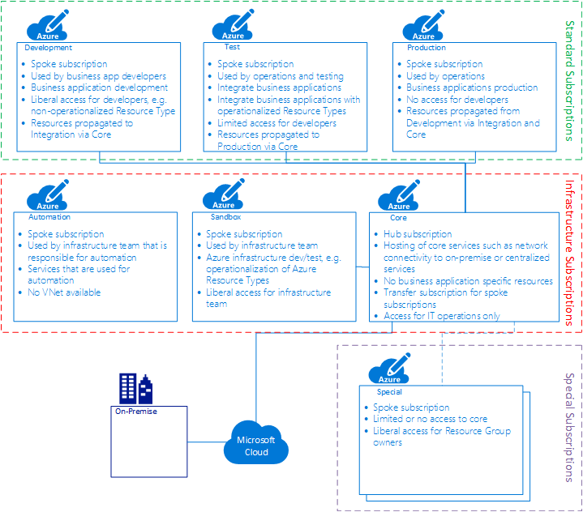

# Subscriptions
Azure Subscriptions are implemented in a hub and spoke model. The individual Subscriptions are grouped into three different categories. Depending on the policy and IAM requirement the categories might be modelled as Management Groups.

 

## Infrastructure Subscriptions
These Subscriptions are used by the infrastructure teams and don’t host any business workloads.

### Automation Subscription
The question of the question, whether the chicken or the egg was too first, that question we have also with the Subscriptions. Where do we start with deployment, and what will remain safe in the end, even if a kind of reset is performed?

This Subscription provides all the resources needed to deploy the remaining resources. Also in this Subscription are content such as Workspaces for Log Analytics, witch need of persistence, security and compliance.

At the moment it would not be the idea to provide a VNet in this Subscription.

### Core Subscription (Hub)
This basically resembles the setup of on-premise data centers, where core infrastructure services (DNS, backup, AD etc.) are operated by a core IT team. These core services are made available to the different environments that host the business-related workloads. 

Likewise, there is a Core Subscription that hosts core services and is operated by the core infrastructure team. If possible, there are no business workload operated in this subscription. Some exceptions might have to be made for Azure Resource Types that can be instantiated once per customer, such as Azure Data Catalog.

### Sandbox Subscription (Spoke)
The infrastructure team is performing Azure related PoC, development and testing in the Sandbox Subscription. Examples of activities are the operationalization of Azure Resource Types, development of Automation Runbooks, PoC of Resource Types to be introduced. All these activities are executed from an infrastructure point of view. The development teams preform their functional testing in a special Subscription.\
Example:
- The development team deploys Cosmos DB in a special Subscription to determine if this PaaS could be used in the context of a new business application to be developed. 
- The infrastructure team will deploy Cosmos DB in the Sandbox to understand the security, financial and operational ramifications. 

## Standard Subscriptions (Spoke)
In addition to the Core Subscription there are three Standard Subscriptions for Development, Test and Production. These are all operated by the core infrastructure team. Only operationalized Azure Resource Types are deployed into these Subscriptions. From a policy point of view a white-listing approach is used. 

Access and deployment methods become ever more restrictive from Subscription to Subscription. In the Development Subscription, the developers are free to deploy Resources as they please, using service requests, Azure portal or the IDE (Integrated Development Environment). 

In the Test Subscription the deployment of Resources is in an automated manner only. This can be achieved by triggering the automation from a service requests or a CI/CD framework. This Subscription therefore is also used to test the integrated deployment of Azure resources and business applications.
The Production environment is accessibly by the operate teams only. Developers will only gain temporary access in trouble shooting situations. 

## Special Subscriptions (Spoke)
A differentiation must be made between criteria for placing a workload into a Special Subscriptions (as opposed to a standard Subscription) and creating a new special Subscription (as opposed to using an existing one).
The goal is to maintain as few Special Subscriptions as possible. Special Subscriptions that are created for a specific project should be time boxed, to prevent a multiplication of stale Subscriptions. 
### Placement Criteria
The following criteria must be met for placing a workload into a special Subscription:
- One or several of the required Resource Types are not available in the Development Subscription.
- Policies in the Development Subscription would have to be altered – but can’t for e.g. security reasons. 
- The resources are used for a PoC or an exploratory project, but not for development.
 
### Creation Criteria
- The resource requirements are such that the Azure Subscription Limits and Quotas might be reached, impacting other workload in the Subscription.
- Subscriptions operated by third parties such as development partners or subsidiaries.

### Limits, quotas and constraints

Find the most current version here: <https://docs.microsoft.com/en-us/azure/azure-subscription-service-limits>

## Sources

Source:
- [Functional Specification document - Felix Bodmer](https://dev.azure.com/felixbodmername/Azure/_wiki/wikis/Azure.wiki)
- [Subscriptions on docs.microsoft.com](https://docs.microsoft.com/en-us/azure/azure-resource-manager/resource-manager-subscription-governance)
- [Subscription Service Limits](https://docs.microsoft.com/en-us/azure/azure-subscription-service-limits)
- <https://docs.microsoft.com/en-us/azure/architecture/cloud-adoption-guide/adoption-intro/subscription>

