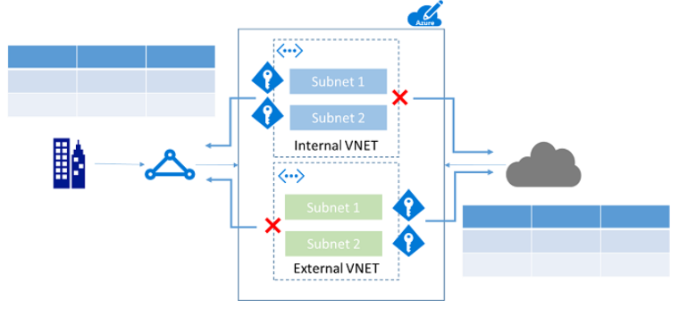

# Managing security, compliance and data privacy

## Infrastructure protection

### VM Security

VM Authentication and access control

The first step in protecting your VM is to ensure that only authorized users are able to set up new VMs. You can use Azure policies to establish conventions for resources in your organization, create customized policies, and apply these policies to resources, such as resource groups.

VMs that belong to a resource group naturally inherit its policies. Although we recommend this approach to managing VMs, you can also control access to individual VM policies by using role-based access control (RBAC).

When you enable Resource Manager policies and RBAC to control VM access, you help improve overall VM security. We recommend that you consolidate VMs with the same life cycle into the same resource group. By using resource groups, you can deploy, monitor, and roll up billing costs for your resources. To enable users to access and set up VMs, use a least privilege approach. And when you assign privileges to users, plan to use the following built-in Azure roles:

  - **Virtual Machine Contributor:** Can manage VMs, but not the virtual network or storage account to which they are connected.

  - **Security Manager:** Can manage security components, security policies, and VMs.

  - **DevTest Labs User:** Can view everything and connect, start, restart, and shut down VMs.

Don't share accounts and passwords between administrators, and don't reuse passwords across multiple user accounts or services, particularly passwords for social media or other non-administrative activities. Ideally, you should use Azure Resource Manager templates to set up your VMs securely. By using this approach, you can strengthen your deployment choices and enforce security settings throughout the deployment.

Organizations that do not enforce data-access control by taking advantage of capabilities such as RBAC might be granting their users more privileges than necessary. Inappropriate user access to certain data can directly compromise that data.

## Network security

### Core networking resources

Access to resources can be either internal (within the corporation's network) or external (through the internet). It is easy for users in your organization to inadvertently put resources in the wrong spot, and potentially open them to malicious access. As with on-premises devices, enterprises must add appropriate controls to ensure that Azure users make the right decisions. For subscription governance, we identify core resources that provide basic control of access. The core resources consist of:

  - **Virtual networks** are container objects for subnets. Though not strictly necessary, it is often used when connecting applications to internal corporate resources.  
  - **Network security groups** are similar to a firewall and provide rules for how a resource can "talk" over the network. They provide granular control over how/if a subnet (or virtual machine) can connect to the Internet or other subnets in the same virtual network.

  - Create virtual networks dedicated to external-facing workloads and internal-facing workloads. This approach reduces the chance of inadvertently placing virtual machines that are intended for internal workloads in an external facing space.

  - Configure network security groups to limit access. At a minimum, block access to the internet from internal virtual networks, and block access to the corporate network from external virtual networks.

Microsoft Azure enables you to connect virtual machines and appliances to other networked devices by placing them on Azure Virtual Networks. An Azure Virtual Network is a construct that allows you to connect virtual network interface cards to a virtual network to allow TCP/IP-based communications between network enabled devices. Azure Virtual Machines connected to an Azure Virtual Network are able to connect to devices on the same Azure Virtual Network, different Azure Virtual Networks, on the Internet or even on your own on-premises networks.

Azure Virtual Networks are similar to a LAN on your on-premises network. The idea behind an Azure Virtual Network is that you create a single private IP address space-based network on which you can place all your Azure Virtual Machines. The private IP address spaces available are in the Class A (10.0.0.0/8), Class B (172.16.0.0/12), and Class C (192.168.0.0/16) ranges.
