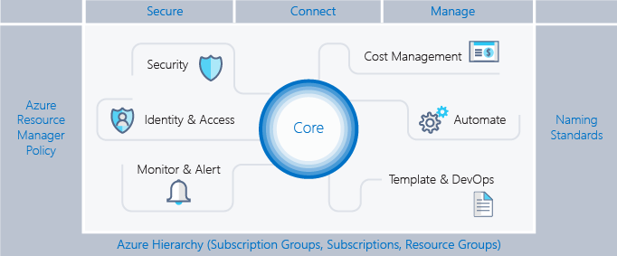
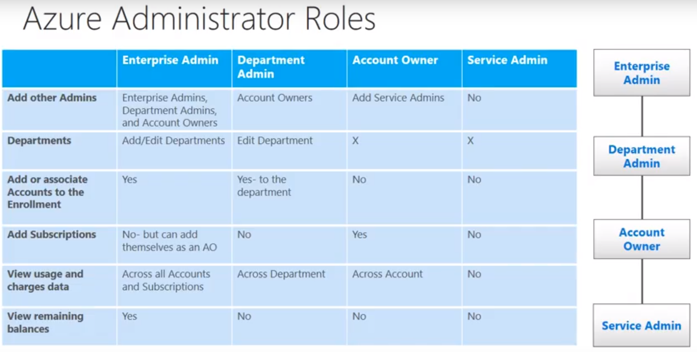
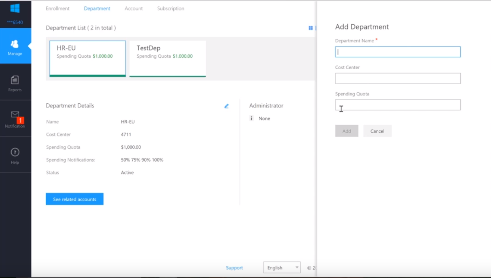
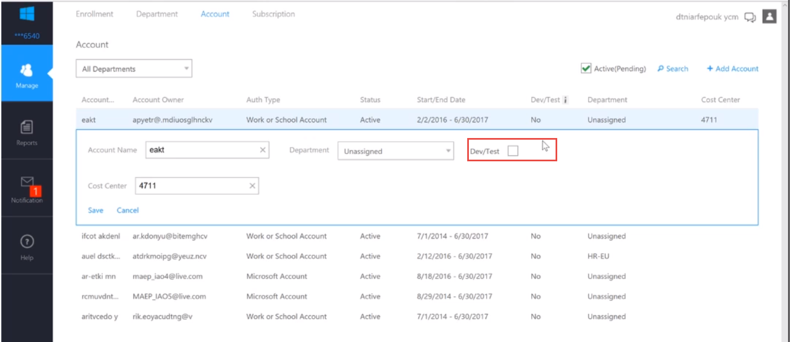
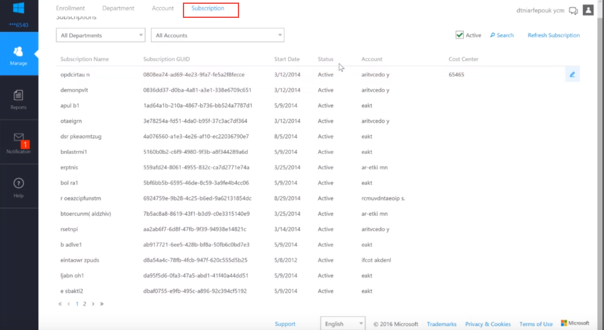
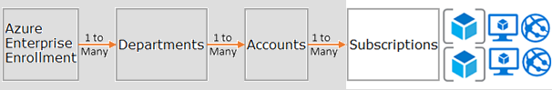

# Governance

An enterprise scaffold a set of flexible controls and Azure capabilities that provide structure to the environment, and anchors for services built on the public cloud. It provides the builders (IT and business groups) a foundation to create and attach new services.

The following image describes the components of the scaffold. The foundation relies on a solid plan for departments, accounts, and subscriptions. The pillars consist of Resource Manager policies and strong naming standards. The rest of the scaffold comes from core Azure capabilities and features that enable a secure and manageable environment. The enterprise scaffold is explicitly designed for the Resource Manager model.

## Hierarchy for Enterprise enrollments

The foundation of the scaffold is the Azure Enterprise Enrollment (and the Enterprise Portal). The enterprise enrollment defines the shape and use of Azure services within a company and is the core governance structure. Within the enterprise agreement, customers can further subdivide the environment into departments, accounts and finally, subscriptions. An Azure subscription is the basic unit where all resources are contained. It also defines several limits within Azure, such as number of cores, resources, etc.

Every enterprise is different and the hierarchy in the previous image allows for significant flexibility in how Azure is organized within the company. Before implementing the guidance contained in this document, the hierarchy should be modelled and the impact on billing, resource access, and complexity understood.

### Patterns ###

The three common patterns for Azure enrolments are:

  - Functional pattern

  - Business unit pattern

  - Geographic pattern

The following roles will be defined:

EA = Enterprise Admin, DA = Department Admin, AO = Account Owner, SA = Service Admin

First, the administrators are defined in the portal (ea.azure.com). This could be either a Microsoft or a work or school account. We recommend using a Work-Account.

Secondly, the departments are created. A department can’t live without DA. If there is no DA specified, the EA will be the DA of the department:

Once the department is created, accounts can be created on the department. Each department needs to have account owners, those are the only one who can create subscriptions on the account. If a EA wants to create subscriptions on an account, he needs to add himself as the account owner.

At the account level, each account can be named as Dev/Test and therefore be treated separately:

When the account is created, a subscription can be assigned:

This approach is resumed in the CSP Model - whereas the customer doesn’t have an Enterprise portal, but multiple subscriptions that are bound to his Active Directory.

Source: <https://docs.microsoft.com/en-us/azure/security/governance-in-azure>
Source: <https://www.credera.com/blog/credera-site/azure-governance-part-2-using-subscriptions-resource-groups-building-blocks/>

## CSP Hierarchy

If Azure Services are provided by a Cloud Service Provider, all the administrative elements above the subscription are eliminated. Within the CSP, the different defined subscriptions are bound directly to an Azure Active Directory (Azure AD).

CSP provided Azure subscriptions can only be managed over the ARM (Azure Resource Manager) Portal. There are no service or co-administrators. To control access, Azure provides roles (see chapter 16.3 Role based access control (RBAC)).

The CSP licence provider is always the owner over all of the ordered subscriptions and defines who else is owner of a subscription. This definition is modelled on the Azure AD tenant of the CSP.

The rights on the Subscription come over a Foreign Principal from the CSP Tenant. You can only choose between the following roles:
- Admin Agent
- Helpdesk Agent
- Sales Agent

The problem is, that this authorization will be applied overall tenants at the same time. And currently, it is not possible to use Privileged Identity Management for clients, from CSP Tenant.

Source: <https://docs.microsoft.com/en-us/azure/cloud-solution-provider/customer-management/administration-delegation>

## Lighthouse

Azure Lighthouse offers service providers a single control plane to view and manage Azure across all their customers with higher automation, scale, and enhanced governance. With Azure Lighthouse, service providers can deliver managed services using comprehensive and robust management tooling built into the Azure platform. This offering can also benefit enterprise IT organizations managing resources across multiple tenants.

This helps to fill the gap from the CSP right delegation. With Azure Lighthouse it's possible to delegate a lot of services, granularly per customer. The following are to the beginning supported services:
- Azure Automation
- Azure Backup
- Azure Monitor
- Azure Policy
- Azure Resource Graph
- Azure Security Center
- Azure Service Health
- Azure Site Recovery
- Azure Virtual Machines
- Azure Virtual Network

Under the following link you can find the current list:
https://docs.microsoft.com/en-us/azure/lighthouse/concepts/cross-tenant-management-experience#supported-services-and-scenarios

Source: <https://docs.microsoft.com/en-us/azure/lighthouse/overview>
Source: <https://docs.microsoft.com/en-us/azure/lighthouse/concepts/cross-tenant-management-experience>

## Resource Locks

As organizations add core services to the subscription, it becomes increasingly important to ensure that those services are available to avoid business disruption. Resource locks enable to restrict operations on high-value resources where modifying or deleting them would have a significant impact on your applications or cloud infrastructure. You can apply locks on a subscription-, resource group-, or resource-level. Typically, you apply locks to foundational resources such as **virtual networks, gateways, and storage accounts.**

Resource locks currently support two values: **CanNotDelete** and **ReadOnly**. **CanNotDelete** means that users (with the appropriate rights) can still read or modify a resource but cannot delete it. **ReadOnly** means that authorized users can't delete or modify a resource.

To create or delete management locks, you must have access to Microsoft.Authorization/* or Microsoft.Authorization/locks/* actions. Of the built-in roles, only Owner and User Access Administrator are granted those actions.

We recommend to protect core network options with locks. Accidental deletion of a gateway, site-to-site VPN would be disastrous to an Azure subscription. Azure doesn't allow you to delete a virtual network that is in use, but applying more restrictions is a helpful precaution.

- Virtual Network: CanNotDelete
- Network Security Group: CanNotDelete
- Policies: CanNotDelete

Policies are also crucial to the maintenance of appropriate controls. We recommend that you apply a CanNotDelete lock to polices that are in use. Policies can be set via Azure Blueprint.

Source: https://docs.microsoft.com/en-us/azure/azure-resource-manager/resource-manager-subscription-governance#azure-resource-locks

## Azure Policy

IT governance creates clarity between business goals and IT projects. Good IT governance involves planning your initiatives and setting priorities on a strategic level. Does your company experience a significant number of IT issues that never seem to get resolved? Implementing policies helps you better manage and prevent them. Implementing policies is where Azure Policy comes in.

Azure Policy is a service in Azure that you use to create, assign and, manage policy definitions. Policy definitions enforce different rules and actions over your resources, so those resources stay compliant with your corporate standards and service level agreements. Azure Policy runs an evaluation of your resources, scanning for those not compliant with the policy definitions you have. For example, you can have a policy to allow only certain type of virtual machines. **Another requires that all resources have a particular tag**. These policies are then evaluated when creating and updating resources.

Source: https://docs.microsoft.com/en-au/azure/governance/policy/overview

### How is Azure Policy different from RBAC?

There are a few key differences between policy and role-based access control (RBAC). RBAC focuses on user actions at different scopes. For example, you might be added to the contributor role for a resource group at the desired scope. The role allows you to make changes to that resource group. Policy focuses on resource properties during deployment and for already existing resources. For example, through policies, you can control the types of resources that can be provisioned. Or, you can restrict the locations in which the resources can be provisioned. Unlike RBAC, policy is a default allow and explicit deny system.

To use policies, you must be authenticated through RBAC. Specifically, your account needs the:

- 'Microsoft.Authorization/policydefinitions/write' permission to define a policy.
- 'Microsoft.Authorization/policyassignments/write' permission to assign a policy.
- 'Microsoft.Authorization/policySetDefinitions/write' permission to define an initiative.
- 'Microsoft.Authorization/policyassignments/write' permission to assign an initiative.

These permissions are not included in the Contributor role.

Source: https://docs.microsoft.com/en-au/azure/governance/policy/overview#how-is-it-different-from-rbac

### Policy Definition

Every policy definition has conditions under which it is enforced. Additionally, it has an accompanying action that takes place if the conditions are met.

Azure Policy offers some built-in policies that are available to you by default. For example:

- Require SQL Server 12.0
  This policy definition has conditions/rules to ensure that all SQL servers use version 12.0. Its action is to deny all servers that do not meet these criteria.
- Allowed Storage Account SKUs
  This policy definition has a set of conditions/rules that determine if a storage account that is being deployed is within a set of SKU sizes. Its action is to deny all servers that do not adhere to the set of defined SKU sizes.
- Allowed Resource Type
  This policy definition has a set of conditions/rules to specify the resource types that your organization can deploy. Its action is to deny all resources that are not part of this defined list.
- Allowed Locations
  This policy enables you to restrict the locations that your organization can specify when deploying resources. Its action is used to enforce your geo-compliance requirements.
- Allowed Virtual Machine SKUs
  This policy enables you to specify a set of virtual machine SKUs that your organization can deploy.
- Apply tag and its default value
  This policy applies a required tag and its default value, if it is not specified by the user.
- Enforce tag and its value
  This policy enforces a required tag and its value to a resource.
- Not allowed resource types
  This policy enables you to specify the resource types that your organization cannot deploy.

You can assign any of these policies through the Azure portal, PowerShell, or Azure CLI.

Source: https://docs.microsoft.com/en-au/azure/governance/policy/overview#policy-definition
