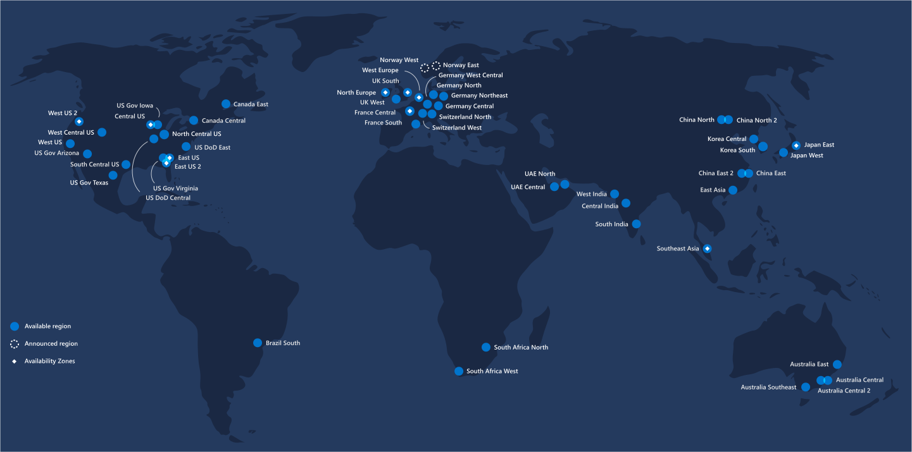

# Azure Regions

## Introduction

Azure has more global regions than any other cloud provider—offering the scale needed to bring applications closer to users around the world, preserving data residency, and offering comprehensive compliance and resiliency options for customers. Currently there are 54 Regions worldwide, and Azure is available in 140 countries.

A region is a set of datacenters deployed within a latency-defined perimeter and connected through a dedicated regional low-latency network. With more global regions than any other cloud provider, Azure gives customers the flexibility to deploy applications where they need to.

A geography is a discrete market, typically containing two or more regions, that preserves data residency and compliance boundaries. Geographies allow customers with specific data-residency and compliance needs to keep their data and applications close. Geographies are fault-tolerant to withstand complete region failure through their connection to our dedicated high-capacity networking infrastructure.

Availability Zones are physically separate locations within an Azure region. Each Availability Zone is made up of one or more datacenters equipped with independent power, cooling, and networking. Availability Zones allow customers to run mission-critical applications with high availability and low-latency replication.

Source: https://azure.microsoft.com/en-us/global-infrastructure/regions/

You can test the latency, upload speed etc. on the website [Azurespeed](http://www.azurespeed.com/). There is also an interactive world map with the datacenters: [Azure Worldmap Interactive](https://map.buildazure.com/)

## Region pairing

Each Azure region is paired with another region within the same geography, together making a regional pair. The exception is Brazil South, which is paired with a region outside its geography. Across the region pairs Azure serializes platform updates (planned maintenance), so that only one paired region is updated at a time. In the event of an outage affecting multiple regions, at least one region in each pair will be prioritized for recovery.

Source: https://docs.microsoft.com/en-us/azure/best-practices-availability-paired-regions

## Recover from a region-wide service disruption

Under rare circumstances, it is possible that facilities in an entire region can become inaccessible, for example due to network failures. Or facilities can be lost entirely, for example due to a natural disaster. This section explains the capabilities of Azure for creating applications that are distributed across regions. Such distribution helps to minimize the possibility that a failure in one region could affect other regions.

Some aspects for a general failover strategy are listed here: [Azure Failover Strategies](https://docs.microsoft.com/en-us/azure/architecture/resiliency/recovery-loss-azure-region)

[recommendations]: # ( start )

## Design for regional services

Often you'll have a datacenter near or in your country, but for several reasons, you might deploy your services worldwide - either for pricing, or because of latency. The placement of the hub or Tier 0 subscription is important in this case (Tier 0 is the subsription where your on premises connection terminates), because it defines the circle of possibilities. A general best practice is to place the Tier 0 in your country (or the nearest resp. most compliant region), because then you are able to deliver local (or most compliant) services, which you are not if you select a random region.

[recommendations]: # ( end )

## Migrate to another Region

Migration to another Azure Region is only possible for virtual machines. You are best suited with managed disks. However, availability sets, networks and load balancers can be recreated by Azure Site Recovery. This makes region moves a pretty complex task with either a lot of manual work or prescripting.
