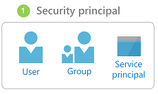
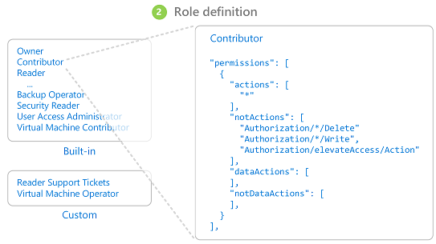
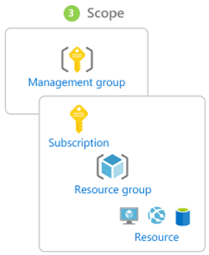
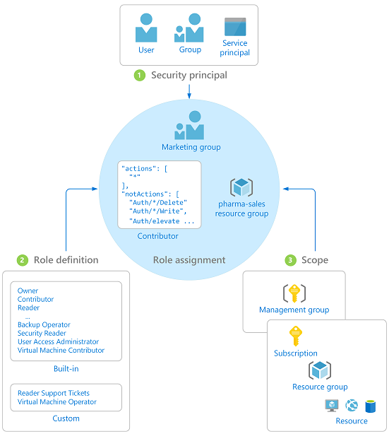

# Role based access control (RBAC)

Azure Role-Based Access Control (RBAC) enables fine-grained access management for Azure. Using RBAC, you can grant only the amount of access that users need to perform their jobs. We recommend going with the [least privilege security principles](https://en.wikipedia.org/wiki/Principle_of_least_privilege).

Within each subscription, you can grant up to 2000 role assignments.

Restricting access based on the **least privilege security principles** is imperative for organizations that want to enforce security policies for data access. Azure Role-Based Access Control (RBAC) can be used to assign permissions to users, groups, and applications at a certain scope. The scope of a role assignment can be a subscription, a resource group, or a single resource.

You can leverage built in RBAC roles in Azure to assign privileges to users. Consider using Storage Account Contributor for cloud operators that need to manage storage accounts. For cloud operators that needs to manage VMs and storage account, consider adding them to Virtual Machine Contributor role.

Organizations that do not enforce data access control by leveraging capabilities such as RBAC may be giving more privileges than necessary to their users. This can lead to data compromise by allow users access to certain types of types of data (e.g., high business impact) that they shouldn’t have in the first place.

## Security Principal

A security principal is an object that represents a user, group, or service principal that is requesting access to Azure resources.

  - **User** - An individual who has a profile in Azure Active Directory. You can also assign roles to users in other tenants. For information about users in other organizations, see Azure Active Directory B2B.

  - **Group** - A set of users created in Azure Active Directory. When you assign a role to a group, all users within that group have that role.

  - **Service principal** - A security identity used by applications or services to access specific Azure resources. You can think of it as a user identity (username and password or certificate) for an application.

## Role definition

A role definition is a collection of permissions. It's sometimes just called a role. A role definition lists the operations that can be performed, such as read, write, and delete. Roles can be high-level, like owner, or specific, like virtual machine reader.

### Built-in Roles

  - Owner - Has full access to all resources including the right to delegate access to others.

  - Contributor - Can create and manage all types of Azure resources but can’t grant access to others.

  - Reader - Can view existing Azure resources.

  - User Access Administrator - Lets you manage user access to Azure resources.

## Custom Roles

If the built-in roles don’t meet the specific needs of the organization, there can be created custom roles. Just like built-in roles, custom roles can be assigned to users, groups, and service principals at subscription, resource group, and resource scopes. Custom roles are stored in an Azure Active Directory (Azure AD) tenant and can be shared across subscriptions. Each tenant can have up to 2000 custom roles. Custom roles can be created using Azure PowerShell, Azure CLI, or the REST API.

## Scope

Scope is the boundary that the access applies to. When you assign a role, you can further limit the actions allowed by defining a scope. This is helpful if you want to make someone a Website Contributor, but only for one resource group.

In Azure, you can specify a scope at multiple levels: subscription, resource group, or resource. Scopes are structured in a parent-child relationship where every child will have only one parent.

Access that you assign at a parent scope is inherited at the child scope. For example:

  - If you assign the Reader role to a group at the subscription scope, the members of that group can view every resource group and resource in the subscription.

  - If you assign the Contributor role to an application at the resource group scope, it can manage resources of all types in that resource group, but not other resource groups in the subscription.

Azure also includes a scope above subscriptions called management groups (See 6 Management Groups). When you specify scope for RBAC, you can either specify a management group or specify a subscription, resource group, or resource hierarchy.

## Assignment

A role assignment is the process of binding a role definition to a user, group, or service principal at a particular scope for the purpose of granting access. Access is granted by creating a role assignment, and access is revoked by removing a role assignment.

The diagram shows an example of a role assignment. In this example, the Marketing group has been assigned the Contributor role for the pharma-sales resource group. This means that users in the Marketing group can create or manage any Azure resource in the pharma-sales resource group. Marketing users do not have access to resources outside the pharma-sales resource group, unless they are part of another role assignment.

Sources: <https://docs.microsoft.com/en-us/azure/role-based-access-control/overview>
