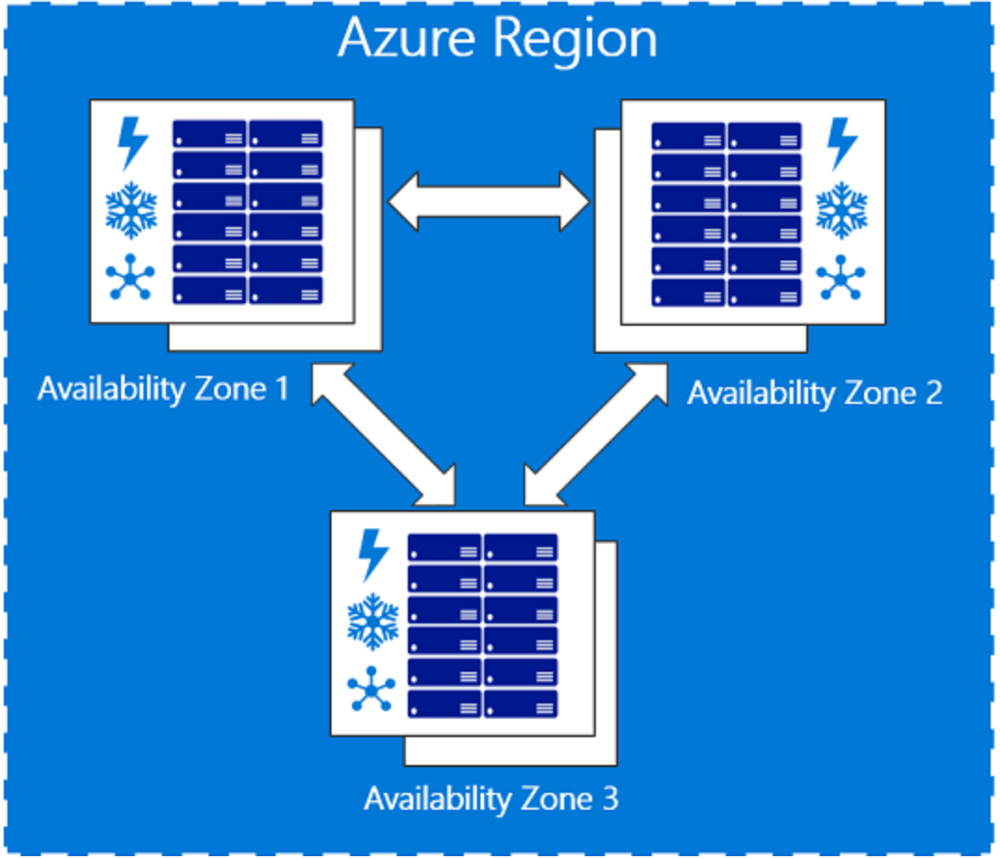

# Availability in Azure

## Planned and unplanned maintenance in Azure

Azure periodically performs updates to improve the reliability, performance, and security of the host infrastructure for virtual machines. These updates range from patching software components in the hosting environment (like operating system, hypervisor, and various agents deployed on the host), upgrading networking components, to hardware decommissioning. The majority of these updates are performed without any impact to the hosted virtual machines. However, there are cases where updates do have an impact:

  - If a reboot-less update is possible, Azure uses memory preserving maintenance to pause the VM while the host is updated or the VM is moved to an already updated host altogether.

  - If maintenance requires a reboot, you get a notice of when the maintenance is planned. In these cases, you'll also be given a time window where you can start the maintenance yourself, at a time that works for you.

Planned maintenance that requires a reboot, is scheduled in waves. Each wave has different scope (regions).

  - A wave starts with a notification to customers. By default, notification is sent to subscription owner and co-owners. You can add more recipients and messaging options like email, SMS, and Webhooks, to the notifications using Azure Activity Log Alerts.

  - At the time of the notification, a self-service window is made available. During this window, you can find which of your virtual machines are included in this wave and proactively start maintenance according to your own scheduling needs.

  - After the self-service window, a scheduled maintenance window begins. At some point during this window, Azure schedules and applies the required maintenance to your virtual machine.

The goal in having two windows is to give you enough time to start maintenance and reboot your virtual machine while knowing when Azure will automatically start maintenance.

You can use the Azure portal, PowerShell, REST API, and CLI to query for the maintenance windows for your VMs and start self-service maintenance.

Source: https://docs.microsoft.com/en-gb/azure/virtual-machines/windows/maintenance-and-updates

## Understand VM Reboots – maintenance vs. downtime

There are three scenarios that can lead to virtual machine in Azure being impacted: unplanned hardware maintenance, unexpected downtime, and planned maintenance.

  - **Unplanned Hardware Maintenance Event** occurs when the Azure platform predicts that the hardware or any platform component associated to a physical machine, is about to fail. When the platform predicts a failure, it will issue an unplanned hardware maintenance event to reduce the impact to the virtual machines hosted on that hardware. **Azure uses Live Migration technology to migrate the Virtual Machines from the failing hardware to a healthy physical machine**. Live Migration is a VM preserving operation that only pauses the Virtual Machine for a short time. Memory, open files, and network connections are maintained, but performance might be reduced before and/or after the event. In cases where Live Migration cannot be used, the VM will experience Unexpected Downtime, as described below.

  - **An Unexpected Downtime** is when the hardware or the physical infrastructure for the virtual machine fails unexpectedly. This can include local network failures, local disk failures, or other rack level failures. When detected, the Azure platform automatically migrates (heals) your virtual machine to a healthy physical machine in the same datacenter. During the healing procedure, virtual machines **experience downtime (reboot)** and in some cases loss of the temporary drive. The attached OS and data disks are always preserved.

Virtual machines can also experience downtime in the unlikely event of an outage or disaster that affects an entire datacenter, or even an entire region. For these scenarios, Azure provides protection options including availability zones and paired regions.

  - **Planned Maintenance events** are periodic updates made by Microsoft to the underlying Azure platform to improve overall reliability, performance, and security of the platform infrastructure that your virtual machines run on. Most of these updates are performed without any impact upon your Virtual Machines or Cloud Services. While the Azure platform attempts to use VM Preserving Maintenance in all possible occasions, there are rare instances when these updates require a reboot of your virtual machine to apply the required updates to the underlying infrastructure. In this case, you can perform Azure Planned Maintenance with Maintenance-Redeploy operation by initiating the maintenance for their VMs in the suitable time window.

Source: https://docs.microsoft.com/en-gb/azure/virtual-machines/linux/manage-availability#understand-vm-reboots---maintenance-vs-downtime

## Availability Sets

### Overview

An availability set is a logical grouping of VMs within a datacenter that allows Azure to understand how your application is built to provide for redundancy and availability. We recommended that two or more VMs are created within an availability set to provide for a highly available application and to meet the **99.95% Azure SLA**. There is no cost for the Availability Set itself, you only pay for each VM instance that you create. When a single VM is using Azure Premium Storage, the Azure SLA applies for unplanned maintenance events.

An availability set is composed of two additional groupings that protect against hardware failures and allow updates to safely be applied - fault domains (FDs) and update domains (UDs). You can read more about how to manage the availability of Linux VMs or Windows VMs.

***Fault domains***

A fault domain is a logical group of underlying hardware that share a common power source and network switch, similar to a rack within an on-premises datacenter. As you create VMs within an availability set, the Azure platform automatically distributes your VMs across these fault domains. This approach limits the impact of potential physical hardware failures, network outages, or power interruptions.

***Update domains***

An update domain is a logical group of underlying hardware that can undergo maintenance or be rebooted at the same time. As you create VMs within an availability set, the Azure platform automatically distributes your VMs across these update domains. This approach ensures that at least one instance of your application always remains running as the Azure platform undergoes periodic maintenance. The order of update domains being rebooted may not proceed sequentially during planned maintenance, but only one update domain is rebooted at a time.

## Availability Zones

### Overview

Availability Zones is an alternative to an Availability Set a high-availability offering that protects your applications and data from datacenter failures. Availability Zones are unique physical locations within an Azure region. Each zone is made up of one or more datacenters equipped with independent power, cooling, and networking. To ensure resiliency, there’s a minimum of three separate zones in all enabled regions. The physical separation of Availability Zones within a region protects applications and data from datacenter failures. Zone-redundant services replicate your applications and data across Availability Zones to protect from single-points-of-failure. **With Availability Zones, Azure offers industry best 99.99% VM uptime SLA**. The full Azure SLA explains the guaranteed availability of Azure as a whole.

An Availability Zone in an Azure region is a combination of a fault domain and an update domain. For example, if you create three or more VMs across three zones in an Azure region, your VMs are effectively distributed across three fault domains and three update domains. The Azure platform recognizes this distribution across update domains to make sure that VMs in different zones are not updated at the same time.

Build high-availability into your application architecture by co-locating your compute, storage, networking, and data resources within a zone and replicating in other zones. Azure services that support Availability Zones fall into two categories:

  - Zonal services – you pin the resource to a specific zone (for example, virtual machines, managed disks, IP addresses), or

  - Zone-redundant services – platform replicates automatically across zones (for example, zone-redundant storage, SQL Database).

To achieve comprehensive business continuity on Azure, build your application architecture using the combination of Availability Zones with Azure region pairs. You can synchronously replicate your applications and data using Availability Zones within an Azure region for high-availability and asynchronously replicate across Azure regions for disaster recovery protection.

Source: https://docs.microsoft.com/en-us/azure/availability-zones/az-overview

### Support of Availability Zones

Regions:

  - Central US

  - East US 2 (Preview)

  - France Central

  - North Europe

  - Southeast Asia (Preview)

  - West Europe

  - West US 2

Services:

  - Linux Virtual Machines

  - Windows Virtual Machines

  - Virtual Machine Scale Sets

  - Managed Disks

  - Load Balancer

  - Public IP address

  - Zone-redundant storage

  - SQL Database

  - Event Hubs

  - Service Bus

  - VPN Gateway

  - ExpressRoute

Source: https://docs.microsoft.com/en-us/azure/availability-zones/az-overview#pricing

### Pricing

There is no additional cost for virtual machines deployed in an Availability Zone. 99.99% VM uptime SLA is offered when two or more VMs are deployed across two or more Availability Zones within an Azure region. There will be additional inter-Availability Zone VM-to-VM data transfer charges.

Source: https://docs.microsoft.com/en-us/azure/availability-zones/az-overview#pricing