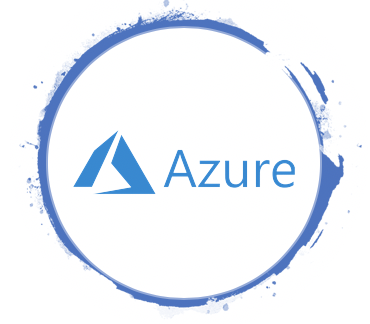

  

# An Open Source Azure Concept

## The idea

Because of various factors like Networking, Subscriptions, and renaming restrictions, you‘ll need a sound Azure Architecture Concept before onboarding to Azure.

A good concept takes a lot of time. This is a blocker for small cloud onboardings and makes things complicated. And why should every company start at the beginning?

Thus the idea of an open sourced concept was born.
Matthias Gessenay started the project, the [Azure Professional Workgroup](https://www.meetup.com/de-DE/Azure-Professional-Workgroup/) jumped in.

We went live on August 19. 2019 - **Here it is!**

## Our goals

- Form a strong foundation for an Azure Architecting Concept
- Help you getting started
- Provide building blocks for your own concept
- Collect good practices from the field
- Enable collaboration!

## Contributors welcome!
Even if you only find a typo, we are very happy about all contributions! Simply edit the content and submit a pull request. If you want to become a regular editor, just email me at [matthias.gessenay@corporatesoftware.ch](mailto:matthias.gessenay@corporatesoftware.ch), I will add you to the team!

